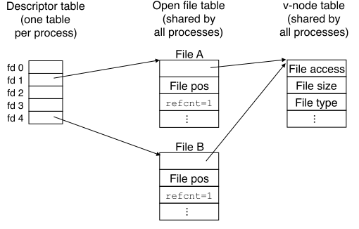
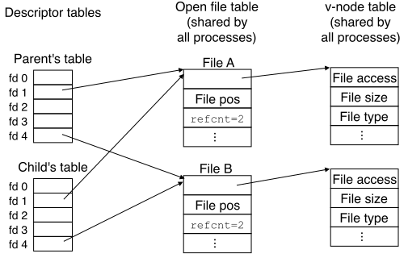
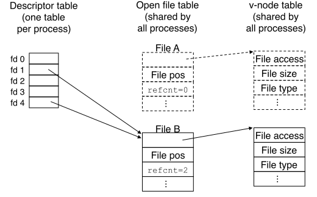
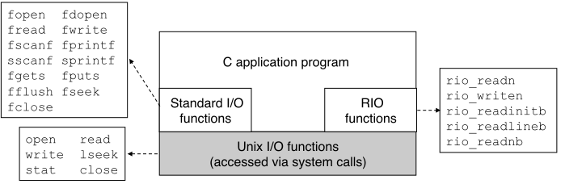

【**读写 (Input/Output, I/O)**】在*主存储器*与*外部设备*之间转移数据。

- [Unix I/O](#unix-io)
- [Standard I/O](#standard-io)
- [Robust I/O](#robust-io)
- [Signal I/O](./8_exceptional_control_flow.md#signal-io)

# 1. Unix I/O<a href id="unix-io"></a>

【**文件 (file)**】在 Linux 系统中所有读写设备（网卡、硬盘、终端）被统称为文件。

- 【**描述符 (descriptor)**】内核分配的非负（小）整数，其中前三个为系统预留：
  - `0 == STDIN_FILENO` 
  - `1 == STDOUT_FILENO`
  - `2 == STDERR_FILENO`
- 【**文件位置 (file position)**】内核维护的非负整数（字节数）
  - 【**查找 (seek)**】跳至指定位置
  - 【**文件末尾 (end-of-file, EOF)**】*读取字节数*大于等于*剩余字节数*所触发的*事件*
- 【**关闭文件 (close file)**】释放数据结构、返还描述符

# 2. 文件

## 常规文件 (regular file)

- 【**文本文件 (text file)**】只含 ASCII 或 Unicode 字符
  - 【`\n`】LF (line feed)
  - 【`\r`】CR (carriage return)
- 【**二进制文件 (binary file)**】

## 目录 (directory)

- 特殊目录
  - 【`.`】
  - 【`..`】
  - 【`/`】
- 常用命令
  - 【`pwd`】**p**rint **w**orking **d**irectory
  - 【`cd`】**c**hange **d**irectory
  - 【`mkdir`】**m**a**k**e **dir**ectory
  - 【`rmdir`】**r**e**m**ove **dir**ectory
- 路径
  - 绝对路径
  - 相对路径

## 套接字 (socket)

见《[网络编程](./11_network_programming.md)》

# 3. 开关文件

## 打开文件

```c
#include <sys/types.h>
#include <sys/stat.h>
#include <fcntl.h>
int open(char *filename, int flags, mode_t mode);
    // Returns: new file descriptor if OK, −1 on error
```

### `flags`

- `O_RDONLY`
- `O_WRONLY`
- `O_RDWR`
- `O_CREAT`
- `O_TRUNC`
- `O_APPEND`

### `mode`

- `S_IRUSR, S_IWUSR, S_IXUSR` can be **r**ead/**w**rite/e**x**ecute by current **us**e**r**
- `S_IRGRP, S_IWGRP, S_IXGRP` can be **r**ead/**w**rite/e**x**ecute by current **gr**ou**p**
- `S_IROTH, S_IWOTH, S_IXOTH` can be **r**ead/**w**rite/e**x**ecute by **oth**ers

```c
#define DEF_MODE  S_IRUSR|S_IWUSR|S_IRGRP|S_IWGRP|S_IROTH|S_IWOTH/* rw-r--r-- */
#define DEF_UMASK S_IWGRP|S_IWOTH                  /* ~DEF_UMASK == rwxr-xr-x */
umask(DEF_UMASK); /* umask = DEF_UMASK */
fd = Open("foo.txt", O_CREAT|O_TRUNC|O_WRONLY, DEF_MODE);
        /* set access permission bits to (DEF_MODE & ~DEF_UMASK) 即 rw-r--r-- */
```

## 关闭文件

```c
#include <unistd.h>
int close(int fd);
```

# 4. 读写文件

```c
#include <unistd.h>
ssize_t  read(int fd,       void *buf, size_t n);
    // Returns: number of bytes read    if OK, −1 on error, 0 on EOF
ssize_t write(int fd, const void *buf, size_t n);
    // Returns: number of bytes written if OK, −1 on error
```

【**不足计数 (short count)**】`read()` 及 `write()` 返回值小于传入的 `n`，可能发生于

- 读到文件末尾（检测到 EOF）
- 从终端读入文本行
- 读写[网络套接字](./11_network_programming.md#socket)或 Linux 管道

# 5. Robust I/O<a href id="robust-io"></a>

## 5.1. 无缓冲读写

适用于从[网络套接字](./11_network_programming.md#socket)读写二进制数据。

```c
#include "csapp.h"
ssize_t rio_readn (int fd, void *usrbuf, size_t n);
ssize_t rio_writen(int fd, void *usrbuf, size_t n);
     /* Returns: number of bytes transferred if OK, −1 on error
                        , 0 on EOF or `n == 0` (rio_readn only) */
```

### `rio_readn()`

```c
ssize_t rio_readn (int fd, void *head, size_t n) {
  size_t nleft = n;
  ssize_t nread;
  char *pos = head;

  while (nleft > 0) {
    if ((nread = read(fd, pos, nleft)) < 0) {
      if (errno == EINTR) /* Interrupted by sig handler return */
        nread = 0;        /* and call `read()` again */
      else
        return -1;        /* `errno` set by `read()` */ 
    }
    else if (nread == 0)
      break;              /* EOF */
    nleft -= nread; pos += nread;
  }
  return (n - nleft);     /* short count only on EOF */
}
```

### `rio_writen()`

```c
ssize_t rio_writen(int fd, void *head, size_t n) {
  size_t nleft = n;
  ssize_t nwritten;
  char *pos = head;

  while (nleft > 0) {
    if ((nwritten = write(fd, pos, nleft)) <= 0) {
      if (errno == EINTR)  /* Interrupted by sig handler return */
        nwritten = 0;      /* and call `write()` again */
      else
        return -1;         /* `errno` set by `write()` */
    }
    nleft -= nwritten; pos += nwritten;
  }
  return n;  /* never returns a short count */
}
```

## 5.2. 有缓冲读入

【需求】[线程安全](./12_concurrent_programming.md#thread-safe)；支持交替读取文本行与二进制数据。

```c
#include "csapp.h"
ssize_t rio_readlineb(rio_t *rp, void *usrbuf, size_t maxlen); /* read 1 line */
ssize_t rio_readnb   (rio_t *rp, void *usrbuf, size_t n);      /* read n bytes */
    // Returns: number of bytes read if OK, 0 on EOF, −1 on error
void    rio_readinitb(rio_t *rp, int fd); /* once per fd */
```

### `rio_readinitb()`

```c
#define RIO_BUFSIZE 8192

typedef struct {
  int rio_fd;            /* Descriptor for this internal buf */
  int rio_cnt;          /* Unread bytes in this internal buf */
  char *rio_bufpos; /* Next unread byte in this internal buf */
  char rio_buf[RIO_BUFSIZE]; /* Internal buffer */
} rio_t;

void rio_readinitb(rio_t *rp, int fd) {
  rp->rio_fd = fd;
  rp->rio_cnt = 0;  
  rp->rio_bufpos = rp->rio_buf;
}
```

### `rio_read()`

```c
/* buffered version of Linux read() */
static ssize_t rio_read(rio_t *rp, char *usrbuf/* user buffer */,
                        size_t n/* number of bytes requested by the user */) {
  int cnt;

  while (rp->rio_cnt <= 0) {  /* Refill if buf is empty */
    rp->rio_cnt = read(rp->rio_fd, rp->rio_buf, RIO_BUFSIZE);
    if (rp->rio_cnt < 0) {
      if (errno != EINTR/* Interrupted by sig handler return */)
        return -1;
    }
    else if (rp->rio_cnt == 0)  /* EOF */
      return 0;
    else
      rp->rio_bufpos = rp->rio_buf; /* Reset buffer ptr */
  }

  /* Copy  bytes from `rp->rio_bufpos` to `usrbuf` */
  cnt = min(n, rp->rio_cnt);
  memcpy(usrbuf, rp->rio_bufpos, cnt);
  rp->rio_bufpos += cnt; rp->rio_cnt -= cnt;
  return cnt;
}
```

### `rio_readlineb()`

```c
ssize_t rio_readlineb(rio_t *rp, void *head, size_t maxlen) {
  int n, rc/* rio count */;
  char c, *pos = head;

  for (n = 1; n < maxlen; n++) { 
    if ((rc = rio_read(rp, &c, 1)) == 1) {
      *(pos++) = c;
      if (c == '\n') {
        n++;
        break;
      }
    }
    else if (rc == 0) {
      if (n == 1)
        return 0; /* EOF, no data read */
      else
        break;    /* EOF, some data was read */
    }
    else
      return -1;  /* Error */
  }
  *pos = 0;       /* end of string */
  return n-1;
}
```

### `rio_readnb()`

```c
ssize_t rio_readnb(rio_t *rp, void *head, size_t n) {
  size_t nleft = n;
  ssize_t nread;
  char *pos = head;

  while (nleft > 0) {
    if ((nread = rio_read(rp, pos, nleft)) < 0) 
      return -1;
    else if (nread == 0)
      break;              /* EOF */
    nleft -= nread; pos += nread;
  }
  return (n - nleft);     /* return >= 0 */
}
```

# 6. 读取文件元数据

## `stat()`

```c
#include <unistd.h>
#include <sys/stat.h>
int stat(const char *filename, struct stat *buf);
int fstat(int fd, struct stat *buf);
```

## `struct stat`

```c
/* Metadata returned by the stat and fstat functions */
/* included by sys/stat.h */
struct stat {
  dev_t st_dev; /* Device */
  ino_t st_ino; /* inode */
  mode_t st_mode; /* Protection and file type */
  nlink_t st_nlink; /* Number of hard links */
  uid_t st_uid; /* User ID of owner */
  gid_t st_gid; /* Group ID of owner */
  dev_t st_rdev; /* Device type (if inode device) */
  off_t st_size; /* Total size, in bytes */
  unsigned long st_blksize; /* Block size for filesystem I/O */
  unsigned long st_blocks; /* Number of blocks allocated */
  time_t st_atime; /* Time of last access */
  time_t st_mtime; /* Time of last modification */
  time_t st_ctime; /* Time of last change */
};
```

## `statcheck.c`

```c
#include "csapp.h"

int main (int argc, char **argv) {
  struct stat stat;
  char *type, *readok;

  if (argc != 2) {
    fprintf(stderr, "usage: %s <filename>\n", argv[0]);
    exit(0);
  }
  Stat(argv[1], &stat);
  if (S_ISREG(stat.st_mode))     /* Determine file type */
    type = "regular";
  else if (S_ISDIR(stat.st_mode))
    type = "directory";
  else 
    type = "other";
  if ((stat.st_mode & S_IRUSR))  /* Check read access */
    readok = "yes";
  else
    readok = "no";

  printf("type: %s, read: %s\n", type, readok);
  exit(0);
}
```

# 7. 读取目录内容

## 开关目录


```c
#include <sys/types.h>
#include <dirent.h>
DIR *opendir(const char *name);
    /* Returns: pointer to handle if OK, NULL on error */
int closedir(DIR *dirp);
    /* Returns: 0 on success, −1 on error */
```

## `readdir()`

```c
#include <dirent.h>
struct dirent {
  ino_t d_ino;   /* inode number */
  char  d_name[256]; /* Filename */
};
struct dirent *readdir(DIR *dirp);
    /* Returns: pointer to next directory entry if OK,
                NULL if no more entries or error */
```

⚠️ 只能通过检查 `errno` 是否被修改，来判断是出错，还是到达列表末尾。

## `readdir.c`

```c
#include "csapp.h"

int main(int argc, char **argv) {
  DIR *streamp; 
  struct dirent *dep; 

  if (argc != 2) {
    printf("usage: %s <pathname>\n", argv[0]);
    exit(1);
  }
  streamp = Opendir(argv[1]);
  errno = 0;
  while ((dep = readdir(streamp)) != NULL) { 
    printf("Found file: %s\n", dep->d_name); 
  } 
  if (errno != 0)
    unix_error("readdir error");

  Closedir(streamp); 
  exit(0);
}
```

# 8. 共享文件



## [`fork()`](./8_exceptional_control_flow.md#fork) 再探



# 9. 读写重定向<a href id="dup2"></a>

```c
#include <unistd.h>
int dup2(int oldfd, int newfd/* close if already open */);
    /* Returns: nonnegative descriptor if OK, −1 on error */
```

`dup2(4, 1)` **dup**licate `fd[4]` **to** `fd[1]`，结果如下：



# 10. Standard I/O<a href id="standard-io"></a>

```c
#include <stdio.h>
extern FILE *stdin;  /* Standard input  (descriptor 0) */
extern FILE *stdout; /* Standard output (descriptor 1) */
extern FILE *stderr; /* Standard error  (descriptor 2) */
```

## 开关文件

```c
FILE *fopen(const char *filename, const char *mode);
int  fclose(FILE *stream);
```

## 读写字符串

```c
char *fgets(      char *dst, int count, FILE *stream);
int   fputs(const char *src,            FILE *stream);
```

## 读写对象

```c
size_t fread (      void *dst, size_t size, size_t count, FILE *stream);
size_t fwrite(const void *src, size_t size, size_t count, FILE *stream );
```

## 格式化读写

```c
int   scanf(              const char *format, ...);
int  fscanf(FILE *stream, const char *format, ...);
int  sscanf(char *buffer, const char *format, ...);
int  printf(              const char *format, ...);
int fprintf(FILE *stream, const char *format, ...);
int sprintf(char *buffer, const char *format, ...);
int  fflush(FILE *output); /* undefined behavior for input */
```

# 11. I/O 库的选择



- 一般场合尽量用 [Standard I/O](#standard-io)。
- 不要用 `scanf()` 或 `rio_readlineb()` 读二进制文件。
- 读写[网络套接字](./11_network_programming.md#socket)用 [Robust I/O](#robust-io)。
  - 格式化读写可以配合 [Standard I/O](#standard-io) 中的 `sscanf()` 及 `sprintf()` 完成。
