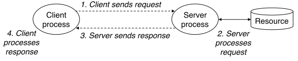
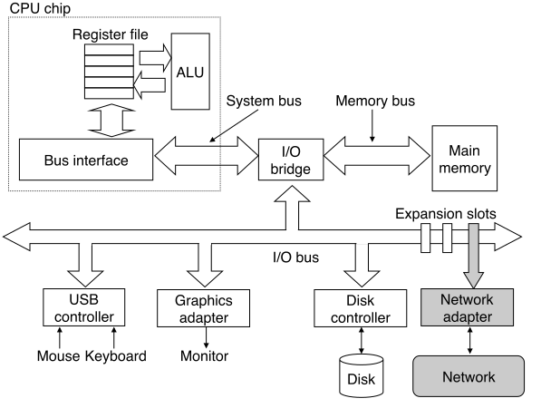
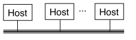
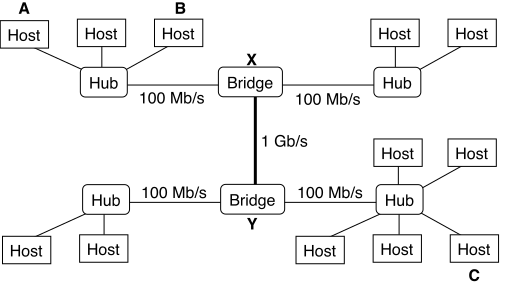
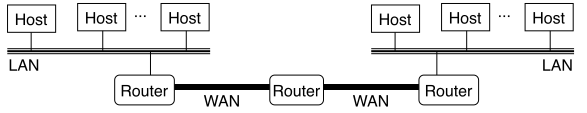
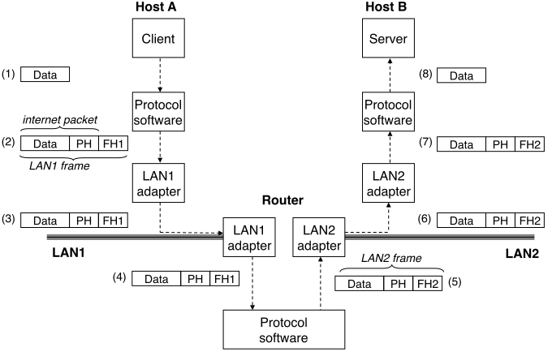
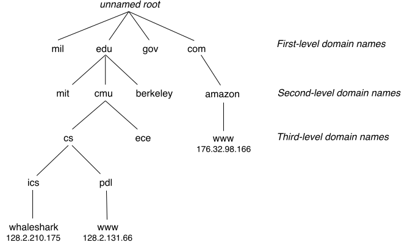
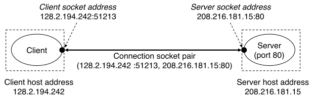
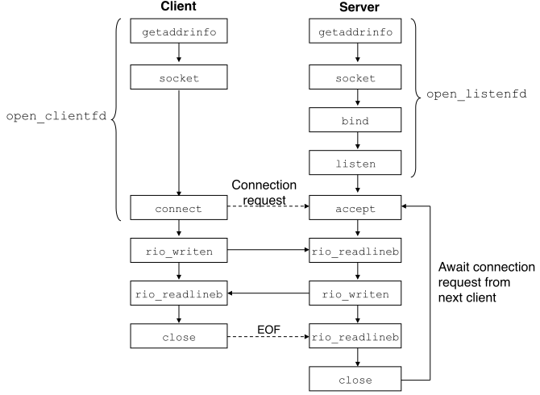

# 1. 客户端–服务端模型

**客户端–服务端模型 (client–server model)** 是所有网络应用程序的基础。

- **服务端 (server)**：管理资源、提供服务的进程。
  - **服务器 (server machine)**：运行服务端的机器。
- **客户端 (client)**：请求资源、使用服务的进程。
  - **客户机 (client machine)**：运行客户端的机器。

**事务 (transaction)** 是客户端与服务端交互的基本操作，含以下四步：

1. 客户端向服务端发送**请求 (request)**。
2. 服务端处理该*请求*，处理过程中按需使用服务器上的资源。
3. 服务端向客户端发送**响应 (response)**，并等待下一个请求。
4. 客户端处理该*响应*。



## P2P (Peer-to-Peer)

本质上仍属于*客户端–服务端*模型，只是其中的每一个进程既是客户端又是服务端。

# 2. 计算机网络

对一台主机而言，**网络适配器 (network adapter)** 相当于另一种读写设备。



## PAN

**个人区域网 (personal area network, PAN)**：用无线（蓝牙）技术把个人使用的电子设备连接起来的网络。

## LAN

**局域网 (local area network, LAN)**：覆盖较小（数十到数千米）范围的网络。



目前最流行的局域网技术为**以太网 (Ethernet)**。

### 以太网段

**以太网段 (Ethernet segment)**：由多台主机通过*以太网线*（双绞线）连接到一台*集线器*所形成的*小型*网络，可覆盖一间或一层房屋。


- **以太网线 (Ethernet wire)**：一端连接到主机上的（俗称*网卡*的）**以太网适配器 (Ethernet adapter)**，另一端连接到集线器上的**端口 (port)**。
- **集线器 (hub)**：工作在*物理层*的网络设备，将每个端口上的数据被动地复制到其他所有端口。因此连接到同一台集线器上的所有主机，都能看到相同的数据。
- 每个以太网适配器都拥有一个 48-bit 的**物理地址 (physical/MAC address)**，以区别于其他适配器。
- 一台主机向其他主机发送的最小数据块称作**帧 (frame)**，其内容除**有效载荷 (payload)** 外，还包括来源地址、目标地址、帧长度的**帧头 (frame header)**。

### 桥接的以太网

**桥接的以太网 (bridged Ethernet)**：由多个以太网段连接到多个网桥所形成的*中型*网络，可覆盖整栋建筑或整个校园。



- **网桥 (bridge)**：工作在*数据链路层*的网络设备，能够自动感知哪些主机可以连接到哪些端口，从而有选择地转发数据。
- **交换机 (switch)**：工作在*数据链路层*的网络设备，可看作多个网桥的集成设备。
- 网桥与网桥之间的带宽可达 1 Gb/s，网桥与集线器之间的带宽通常为 100 Mb/s。

## MAN

**城域网 (metropolitan area network, MAN)**：覆盖几个街区或整个城市的网络。

## WAN

**广域网 (wide area network, WAN)**：由多个局域网互连所形成的*大型*网络，可覆盖几十到几千公里。



- **路由器 (router)**：一种*网络层*的网络设备，在多个局域网及广域网之间转发数据。
  - **报文 (message)**：被传输的数据，被拆分为若干**分组 (packet)** 逐个进行传输。
  - **分组交换 (packet switching)**：路由器收到一个 *packet* 后，先将其放入缓存，再根据 *packet header* 中的*目标地址*从路由器的*转发表*中找到合适的出口，最后把 *packet* 转发给下一个路由器。
    - 早期的分组交换网络：ARPA (Advanced Research Project Agency) net
- **协议 (protocol)**：运行在主机及路由器上的程序，用于协调不同局域网及广域网技术。
  - **命名格式 (naming scheme)**：定义格式统一的主机地址。
  - **发送机制 (delivery mechanism)**：定义数据打包的方式。

### 专线网

军队、铁路、银行、电力等系统内部的网络。

### 互连网

**互连网 (interconnected network, internet)**：由多个局域网、广域网经过*路由器*连接所形成的广域网，可覆盖全球。

- **internet packet** = *(packet) header* + *payload (Data)*
- **LAN frame** = *(frame) header* + *payload (internet packet)*



# 3. 因特网

**全球 IP 互联网 (global IP internet)**，简称**互联网**或**因特网 (Internet)**，是所有*互连网*中最著名、最成功的一个。

因特网中的每台主机都运行着遵循 **TCP/IP 协议**的软件。

- **IP (Internet Protocol)**：提供最基本的命名格式，以及主机到主机的**不可靠 (unreliable)** 传输机制。
- **UDP (Unreliable Datagram Protocol)**：基于 IP 协议的简单扩展，提供进程到进程的*不可靠*传输。
- **TCP (Transmission Control Protocol)**：基于 IP 协议的复杂扩展，提供进程到进程的双向*可靠*传输。

对于普通程序员，Internet 可以理解为由世界上所有具备以下性质的主机所构成的 internet：

- *主机*被映射到 [**IP 地址 (IP address)**](#IP-address)。
- *IP 地址*被映射到[**因特网域名 (Internet domain name)**](#domain-name)。
- 一台主机上的进程可通过[因特网连接](#connection)与另一台主机上的进程**通信 (communicate)**。

常用名词缩写：

- **ISP (Internet Service Provider)**：提供互联网服务的机构（企业），可分为主干 ISP、地区 ISP、本地 ISP。

- **IXP (Internet eXchange Point)**：允许两个网络直接相连并交换分组的设备，又称 **NAP (Network Access Point)**。

## <a href id="IP-address"></a>3.1. IP 地址

IPv4 地址可以用 `uint32_t` 表示。由于历史的原因，它被封装在 `struct` 内：

```c
/* IP address structure */
struct in_addr {
    uint32_t s_addr; /* in network (big-endian) byte order */
};
```

TCP/IP 规定所有整数都采用**大端 (big-endian)** 字节顺序。以下函数用于字节顺序的转换：

```c
#include <arpa/inet.h>
/* Host byte order TO Network byte order */
uint32_t htonl(uint32_t hostlong);
uint16_t htons(uint16_t hostshort);
/* Network byte order TO Host byte order */
uint32_t ntohl(uint32_t netlong);
uint16_t ntohs(uint16_t netshort);
```

IPv4 地址 的**点分十进制记法 (dotted decimal notation)**：用 `.` 分割为 4 段的字符串，每段各表示一个取自 `[0, 256)` 的 8-bit 整数，以十进制表示。例如：IPv4 地址 `(uint32_t) 0x8002c2f2` 可以用 `(char*) "128.2.194.242"` 表示。

IPv6 地址 的**冒号十六进制记法 (colon hexadecimal notation)**：用 `.` 分割为 8 段的字符串，每段各表示一个取自 `[0, 65536)` 的 16-bit 整数，以十六进制表示。

以下函数用于 IP 地址的字符串**表示格式 (`p`resentation format)** 与**网络格式 (`n`etwork format)** 之间的转换：

```c
#include <arpa/inet.h>
int inet_pton(AF_INET, const char *src, void *dst); /* returns
    `1` if OK, 0 if `src` is invalid, `−1` on error and sets `errno` */
const char *inet_ntop(AF_INET, const void *src, char *dst, socklen_t size); /* returns
    pointer to a dotted-decimal string if OK, `NULL` on error
```

其中 `AF_INET` 表示 `void *` 指向 32-bit 的 IPv4 地址（若改为 `AF_INET6`，则表示 `void *` 指向 128-bit 的 IPv6 地址）。

## <a href id="domain-name"></a>3.2. 因特网域名

**域名 (domain name)**：用 `.` 隔开的一组单词（字符、数字、下划线），例如：`csapp.cs.cmu.edu` 为本书网站的域名，从右向左依次为

- 顶级域名 `edu`，同级的域名还有 `gov`、`com` 等。
- 二级域名 `cmu`，同级的域名还有 `mit`、`princeton` 等。
- 三级域名 `cs`，同级的域名还有 `ee`、`art` 等。



**域名系统 (domain name system, DNS)**：
- 管理*域名*与 *IP 地址*之间映射关系的分布式数据库。
- 用 `nslookup` 命令可以查询已知域名所对应的 IP 地址（可能有零到多个）。

## <a href id="connection"></a>3.3. 因特网连接

**连接 (connection)**：一对可以收发字节流的*进程*。

- **端到端 (end-to-end)**：建立在一对*进程*之间。
- **全双工 (full duplex)**：可以在同一时刻双向传输。
- **可靠 (reliable)**：字节流的接收顺序与发送顺序一致。

**套接字 (socket)**：连接的一端，用形如 `ip_address:port` 的[套接字](#socket)地址表示，其中 `(uint16_t) port` 为**端口号 (port number)**。

- 客户端的端口号不固定，由操作系统内核自动分配。
- 服务端的端口号相对固定，列于 `/etc/services` 中。



# <a href id="socket"></a>4. 套接字接口



## 4.1. 套接字地址结构

- 对于系统内核，套接字是通信的一个端点。
- 对于应用程序，套接字是一个打开的文件。

```c
/* 泛型套接字地址结构，用于 connect, bind, accept 等函数 */
struct sockaddr {
    uint16_t  sa_family;    /* Protocol family */
    char      sa_data[14];  /* Address data  */
};
typedef struct sockaddr SA;
/* IPv4 套接字地址结构 */
struct sockaddr_in {
    uint16_t        sin_family;  /* 协议族，总是取 `AF_INET` */
    uint16_t        sin_port;    /* 端口号，大端字节顺序 */
    struct in_addr  sin_addr;    /* IPv4 地址，大端字节顺序 */
    unsigned char   sin_zero[8]; /* 对齐至 sizeof(struct sockaddr) */
};
```

## 4.2. [`socket()`](https://www.man7.org/linux/man-pages/man2/socket.2.html)

*客户端*及*服务端*均用此函数获得（部分打开的）套接字。若成功则返回**套接字描述符 (socket descriptor)**，否则返回 `-1`。

```c
#include <sys/types.h>
#include <sys/socket.h>
int socket(int domain, int type, int protocol);

/* 典型用法： */
int socket_fd =
    Socket(AF_INET/* IPv4 */, SOCK_STREAM/* 作为连接的一端 */, 0);
```

建议用 [`getaddrinfo()`](#getaddrinfo) 获得实参。

## 4.3. [`connect()`](https://www.man7.org/linux/man-pages/man2/connect.2.html) --- only for client

*客户端*用此函数向*服务端*发送连接请求并等待。若成功则返回 `0`，否则返回 `-1`。

```c
#include <sys/socket.h>
int connect(int client_fd,
    const SA *server_addr, socklen_t server_addr_len/* sizeof(sockaddr_in) */);
```

至此，*客户端*可通过在 `client_fd` 所表示的*文件（套接字）*上读写数据，实现与*服务端*的通信。

## 4.4. [`bind()`](https://www.man7.org/linux/man-pages/man2/bind.2.html) --- only for server

*服务端*用此函数将套接字描述符 `server_fd` 与套接字地址 `server_addr` 关联。
若成功则返回 `0`，否则返回 `-1`。

```c
#include <sys/socket.h>
int bind(int server_fd,
    const SA *server_addr, socklen_t server_addr_len/* sizeof(sockaddr_in) */);
```

## <a href id="listen"></a>4.5. [`listen()`](https://www.man7.org/linux/man-pages/man2/listen.2.html) --- only for server

- **活跃套接字 (active socket)** 是 `socket()` 默认返回的套接字类型，客户端可直接使用。
- **监听套接字 (listening socket)** 专供服务端接收连接请求，记作 `listen_fd`。

*服务端*用此函数将*活跃套接字*转变为*监听套接字*。若成功则返回 `0`，否则返回 `-1`。

```c
#include <sys/socket.h>
int listen(int active_fd,
    int backlog/* 队列大小（请求个数）提示，通常为 1024 */);
```

## 4.6. [`accept()`](https://www.man7.org/linux/man-pages/man2/accept.2.html) --- only for server

*服务端*用此函数等待*客户端*发来的连接请求。
若成功，则返回异于 `listen_fd` 的 `connect_fd`，并获取客户端地址；否则返回 `-1`。

```c
#include <sys/socket.h>
int accept(int listen_fd,
    SA *client_addr, int *client_addr_len);
```

至此，*服务端*可通过在 `connect_fd` 所表示的*文件（套接字）*上读写数据，实现与*客户端*的通信。

## 4.7. 信息提取

### <a href id="getaddrinfo"></a>[`getaddrinfo()`](https://www.man7.org/linux/man-pages/man3/getaddrinfo.3.html)

`getaddrinfo()` 返回一个链表（需用 `freeaddrinfo()` 释放），结点类型为 `struct addrinfo`：


- *客户端*依次用每个结点提供的信息尝试 `socket()` 及 `connect()`，直到成功返回。
- *服务端*依次用每个结点提供的信息尝试 `socket()` 及 `bind()`，直到成功返回。

```c
#include <sys/types.h>
#include <sys/socket.h>
#include <netdb.h>

struct addrinfo {
    int ai_flags; /* AI_ADDRCONFIG | AI_CANONNAME | AI_NUMERICSERV | AI_PASSIVE */
    int ai_family; /* AF_INET | AF_INET6 */
    int ai_socktype; /* SOCK_STREAM */
    int ai_protocol; /* Third arg to socket function */
    char *ai_canonname; /* Canonical hostname */
    size_t ai_addrlen; /* Size of ai_addr struct */
    struct sockaddr *ai_addr; /* Ptr to socket address structure */
    struct addrinfo *ai_next; /* Ptr to next item in linked list */
};

int getaddrinfo(
    const char *host/* 域名 或 地址 */,
    const char *service/* 服务名 或 端口号 */,
    const struct addrinfo *hints/* NULL 或 只含前四项的 addrinfo */,
    struct addrinfo **result/* 输出链表 */
);
void freeaddrinfo(struct addrinfo *result);
const char *gai_strerror(int errcode);
```

### [`getnameinfo()`](https://www.man7.org/linux/man-pages/man3/getnameinfo.3.html)

功能与 `getaddrinfo()` 相反，即由 `sockaddr` 获得 `host` 或 `service`。

```c
#include <sys/socket.h>
#include <netdb.h>
int getnameinfo(
    const struct sockaddr *sa, socklen_t salen,
    char *host, size_t hostlen, /* 可以为空，即 host = NULL, hostlen = 0 */
    char *service, size_t servlen, /* 同上，但至多一行为空 */
    int flags/* NI_NUMERICHOST | NI_NUMERICSERV */);
```

### [`hostinfo.c`](./code/netp/hostinfo.c)

用例：

```shell
$ ./hostinfo www.baidu.com
182.61.200.6
182.61.200.7
```

关键代码：

```c
#include "csapp.h"

int main(int argc, char **argv) {
  struct addrinfo *p, *listp, hints;
  char buf[MAXLINE];
  int rc, flags;
  /* ... */
  memset(&hints, 0, sizeof(struct addrinfo));
  hints.ai_family = AF_INET;       /* 只用 IPv4 */
  hints.ai_socktype = SOCK_STREAM; /* 只面向连接 */
  Getaddrinfo(argv[1], NULL, &hints, &listp);
  flags = NI_NUMERICHOST; /* 以十进制 IP 地址表示 host */
  for (p = listp; p; p = p->ai_next) { /* 遍历链表 */
    Getnameinfo(p->ai_addr, p->ai_addrlen, buf, MAXLINE, NULL, 0, flags);
    printf("%s\n", buf);
  }
  /* ... */
}
```

## 4.8. 辅助函数

### [`open_clientfd()`](./code/src/csapp.c)

此函数提供了对*客户端*调用 `getaddrinfo()`、`socket()`、`connect()` 的封装。

关键代码：

```c
#include "csapp.h"

int open_clientfd(char *hostname, char *port) {
  int clientfd, rc;
  struct addrinfo hints, *listp, *p;

  /* Get a list of potential server addresses */
  memset(&hints, 0, sizeof(struct addrinfo));
  hints.ai_socktype = SOCK_STREAM;  /* Open a connection */
  hints.ai_flags = AI_NUMERICSERV;  /* ... using a numeric port arg. */
  hints.ai_flags |= AI_ADDRCONFIG;  /* Recommended for connections */
  if ((rc = getaddrinfo(hostname, port, &hints, &listp)) != 0) {
    fprintf(/* ... */);
    return -2;
  }

  for (p = listp; p; p = p->ai_next) {
    clientfd = socket(p->ai_family, p->ai_socktype, p->ai_protocol);
    if (clientfd < 0)
      continue;
    if (connect(clientfd, p->ai_addr, p->ai_addrlen) != -1)
      break; /* 连接成功，则终止遍历 */
    if (close(clientfd) < 0) { /* 连接失败，则关闭文件，再尝试下一个 */
      fprintf(/* ... */);
      return -1;
    }
  }

  freeaddrinfo(listp);
  return p ? clientfd : -1;
}
```

### [`open_listenfd()`](./code/src/csapp.c)

此函数提供了对*服务端*调用 `getaddrinfo()`、`socket()`、`bind()`、`listen()` 的封装。

关键代码：

```c
#include "csapp.h"

int open_listenfd(char *port) {
  struct addrinfo hints, *listp, *p;
  int listenfd, rc, optval=1;

  memset(&hints, 0, sizeof(struct addrinfo));
  hints.ai_socktype = SOCK_STREAM;
  hints.ai_flags = AI_ADDRCONFIG | AI_NUMERICSERV
      | AI_PASSIVE/* host=NULL, all ai_addr=*.*.*.* */;
  if ((rc = getaddrinfo(NULL, port, &hints, &listp)) != 0) {
    fprintf(/* ... */);
    return -2;
  }

  for (p = listp; p; p = p->ai_next) {
    listenfd = socket(p->ai_family, p->ai_socktype, p->ai_protocol);
    if (listenfd < 0)
      continue;

    /* Eliminates "Address already in use" error from bind() */
    setsockopt(listenfd, SOL_SOCKET, SO_REUSEADDR,
        (const void *)&optval, sizeof(int));

    if (bind(listenfd, p->ai_addr, p->ai_addrlen) == 0)
      break;
    if (close(listenfd) < 0) {
      fprintf(/* .. */);
      return -1;
    }
  }

  freeaddrinfo(listp);
  if (!p)
    return -1;

  if (listen(listenfd, LISTENQ/* defined in csapp.h */) < 0) {
    close(listenfd);
    return -1;
  }
  return listenfd;
}
```

## 4.9. 示例：回显系统

### [`echoclient.c`](./code/netp/echoclient.c)

关键代码：

```c
#include "csapp.h"

int main(int argc, char **argv) {
  int clientfd;
  char *host, *port, buf[MAXLINE];
  rio_t rio;

  /* ... */

  clientfd = Open_clientfd(host/* argv[1] */, port/* argv[2] */);
  Rio_readinitb(&rio, clientfd);
  while (Fgets(buf, MAXLINE, stdin) != NULL) {
    Rio_writen(clientfd, buf, strlen(buf)); // 向服务端发送
    Rio_readlineb(&rio, buf, MAXLINE);      // 从服务端读取
    Fputs(buf, stdout);                     // 在客户端打印
  }
  Close(clientfd);  // 客户端关闭套接字描述符，服务端会检测到 EOF
  exit(0);
}
```

### [`echoserveri.c`](./code/netp/echoserveri.c)

**迭代型服务端 (iterative server)**：同一时间只能服务一个客户端，不同客户端要排成队列依次接受服务。

关键代码：

```c
#include "csapp.h"

void echo(int connect_fd);  // implemented in echo.c

int main(int argc, char **argv) {
  int listenfd, connect_fd;
  socklen_t client_len;
  struct sockaddr_storage client_addr;  /* Enough space for any address */
  char client_hostname[MAXLINE], client_port[MAXLINE];

  /* ... */

  listenfd = Open_listenfd(/* port */argv[1]);
  while (1) {
    client_len = sizeof(struct sockaddr_storage); 
    connect_fd = Accept(listenfd, (SA *)&client_addr, &client_len);
    Getnameinfo((SA *)&client_addr, client_len,
        client_hostname, MAXLINE, client_port, MAXLINE, 0);
    printf("Connected to (%s, %s)\n", client_hostname, client_port);
    echo(connect_fd);
    Close(connect_fd);
  }
  exit(0);
}
```

### [`echo.c`](./code/netp/echo.c)

```c
#include "csapp.h"

void echo(int connect_fd) {
  size_t n; 
  char buf[MAXLINE]; 
  rio_t rio;

  Rio_readinitb(&rio, connect_fd);
  while((n = Rio_readlineb(&rio, buf, MAXLINE)) != 0) {
    printf("server received %d bytes\n", (int)n);
    Rio_writen(connect_fd, buf, n);
  }
}
```

### 演示

|              服务端               |            |             客户端             |
| :-------------------------------: | :--------: | :----------------------------: |
|    `sudo ./echoserveri 23333`     | ← 启动服务 |                                |
|    `[sudo] password for user:`    | ← 输入密码 |                                |
|                                   | 发送请求 → | `./echoclient localhost 23333` |
| `Connected to (localhost, 44250)` | ← 建立连接 |                                |
|                                   | 发送信息 → |         `hello, world`         |
|    `server received 13 bytes`     | ← 处理信息 |                                |
|                                   | 回显信息 → |         `hello, world`         |
|                                   | 结束连接 → |            `Ctrl+D`            |
|                                   | 再次请求 → | `./echoclient localhost 23333` |
| `Connected to (localhost, 51014)` | ← 建立连接 |                                |
|                                   | 结束连接 → |            `Ctrl+D`            |
|             `Ctrl+C`              | ← 停止服务 |                                |

# 5. 网页服务器

## 5.1. 网页基础

**超文本传输协议 (HyperText Transfer Protocol, HTTP)**：提供**网页 (Web)** 服务的协议

- <a href id="browser"></a>**浏览器 (browser)**：HTTP 的客户端程序
- [**内容 (content)**](#content)：HTTP 的客户端向服务器请求的数据

[**超文本标记语言 (HyperText Markup Language, HTML)**](../../documenting/web/html.md)：

- **页面 (page)**：HTML 的程序
- **标签 (tag)**：HTML 的指令

## <a href id="content"></a>5.2. 网页内容

<a href id="mime"></a>**MIME (Multipurpose Internet Mail Extensions)**

网页内容分类
- **静态内容 (static content)**：服务端传送给客户端的文件
- **动态内容 (dynamic content)**：在服务端上计算得到后传输给客户端的数据

[**URL (Universal Resource Locator)**](https://developer.mozilla.org/en-US/docs/Glossary/URL)：

- 【静态】`http://www.google.com:80/index.html`，其中
  - `www.google.com` 为域名，`80` 为端口号（HTTP 服务的默认端口号为 `80`，可省略）。
  - `/` 表示*服务端所在主机*上用于存放*静态内容*的目录（如 `/usr/httpd/html/`）。
  - `index.html` 为静态内容文件，
- 【动态】`http://bluefish.ics.cs.cmu.edu:8000/cgi-bin/adder?15000&213`，其中
  - `bluefish.ics.cs.cmu.edu` 为域名，`8000` 为端口号。
  - `/cgi-bin/` 表示*服务端所在主机*上用于存放*动态内容*生成程序的目录，如 `/usr/httpd/cgi-bin/`。
  - `adder` 为可执行文件，功能为加法。
  - `?` 之后为 `adder` 的实参列表，`&` 用于分隔实参。

## 5.3. HTTP 事务

### 用 `telnet` 请求 HTTP 服务

在客户机的命令行终端内输入以下内容，以发起连接：

```shell
telnet csapp.cs.cmu.edu 80
```

服务端返回以下三行，显示在客户机的命令行终端：

```
Trying 128.2.100.230...
Connected to csapptest.cs.cmu.edu.
Escape character is '^]'.
```

### HTTP 请求

在客户端输入以下内容（含空行）：

```
GET / HTTP/1.1
Host: csapp.cs.cmu.edu

```

其中

- 第一行称作**请求行 (request line)**，格式为 `method URI version`
  - [**URI (Uniform Resource Identifier)**](https://developer.mozilla.org/en-US/docs/Glossary/URI)
  - 若客户端为[浏览器](#browser)，则 URI 为 URL 的后缀（位于域名、端口号之后的部分）。
  - 若客户端为[代理服务器](./labs/proxy/README.md)，则 URI 为整个 URL。
- <a href id="request_header"></a>第二行开始为**请求头 (request header)**，格式为 `header_name: header_data`
- 最后的空行表示 *request header* 结束。

### HTTP 响应

服务端返回以下内容，打印在客户端：

```
HTTP/1.1 200 OK
Date: Sat, 22 May 2021 16:43:27 GMT
Server: Apache/2.2.15 (Red Hat)
Last-Modified: Mon, 20 Jan 2020 21:53:54 GMT
ETag: "8440768-1882-59c9953d5c080"
Accept-Ranges: bytes
Content-Length: 6274
Connection: close
Content-Type: text/html; charset=UTF-8

```

其中

- 第一行称作**响应行 (response line)**，格式为 `version status_code status_message`。
- 第二行开始为**响应头 (response header)**。
- 最后的空行表示 *response header* 结束。

接下来，客户端显示网页的 HTML 源代码：

```html
<!DOCTYPE html PUBLIC "-//W3C//DTD HTML 4.01 Transitional//EN" "http://www.w3.org/TR/html4/loose.dtd">

<html>
<head>
<title>CS:APP3e, Bryant and O'Hallaron</title>
<link href="http://csapp.cs.cmu.edu/3e/css/csapp.css" rel="stylesheet" type="text/css">
</head>
...
</body>
</html>

```

几秒钟后，客户端显示以下内容，并退出 `telnet`：
```
Connection closed by foreign host.
```

## 5.4. 提供动态内容

**CGI (common gateway interface)**：

### 客户端向服务端传递实参

客户端请求行中的 `GET` 方法将 URI 中的实参传送给服务端，其中

- `?` 分隔*可执行文件*与*实参列表*。
- `&` 分割实参列表中的各项。
- `%20` 表示单项实参中的*空格*。

### 服务端向子进程传递实参

服务端收到 `GET /cgi-bin/adder?15000&213 HTTP/1.1` 后，会依次

- 用 `fork` 创建一个子进程。
- 将 CGI 环境变量 `QUERY_STRING` 设为 `15000&213`。 
- 用 `execve` 加载可执行文件 [`/cgi-bin/adder`](#adder)。

详见 [`serve_dynamic()`](#serve_dynamic)。

### 服务端向子进程传递其他信息

CGI 标准定义了一些环境变量，用于向子进程传递信息：

|     环境变量     |                         作用                          |
| :--------------: | :---------------------------------------------------: |
|  `QUERY_STRING`  |                       程序实参                        |
|  `SERVER_PORT`   |              服务器的[监听端口](#listen)              |
| `REQUEST_METHOD` |                    `GET` 或 `POST`                    |
|  `REMOTE_HOST`   |              客户端[域名](#domain-name)               |
|  `REMOTE_ADDR`   |             客户端 [IP 地址](#IP-address)             |
|  `CONTENT_TYPE`  | 仅供 `POST` 使用，表示所请求对象的 [MIME](#mime) 类型 |
| `CONTENT_LENGTH` |       仅供 `POST` 使用，表示所请求对象的字节数        |

### 子进程向客户端发送结果

加载 CGI 程序前，子进程会用 `dup2()` 将 `stdout` 重定向到 `connect_fd`，从而传递给客户端。

详见 [`serve_dynamic()`](#serve_dynamic)。

### <a href id="adder"></a>[`adder.c`](./code/netp/tiny/cgi-bin/adder.c)

该程序由服务端子进程运行，负责解析 `QUERY_STRING`，计算求和结果，构建响应文本，将向 `stdout` 输出。

关键代码：

```c
#include "csapp.h"

int main(void) {
  char *buf, *p;
  char arg1[MAXLINE], arg2[MAXLINE], content[MAXLINE];
  int n1=0, n2=0;

  /* Extract the two arguments */
  if ((buf = getenv("QUERY_STRING")) != NULL) {
    p = strchr(buf, '&');  // 返回第一个 '&' 的地址
    *p = '\0';
    strcpy(arg1, buf); n1 = atoi(arg1);
    strcpy(arg2, p+1); n2 = atoi(arg2);
  }

  /* Make the response body */
  sprintf(content, /* ... */);

  /* Generate the HTTP response */
  printf("Connection: close\r\n");
  printf("Content-length: %d\r\n", (int)strlen(content));
  printf("Content-type: text/html\r\n\r\n");
  printf("%s", content);
  fflush(stdout);  // 子进程将 stdout 重定向到 connect_fd

  exit(0);
}
```

## 6. 示例：[`tiny.c`](./code/netp/tiny/tiny.c)

### `main()`

负责创建[监听套接字](#listen)套接字，等待服务请求，建立连接后将主要工作转交给 [`doit()`](#doit)。

关键代码：

```c
int main(int argc, char **argv) {
  int listen_fd, connect_fd;
  char hostname[MAXLINE], port[MAXLINE];
  socklen_t client_len;
  struct sockaddr_storage client_addr;

  if (argc != 2) { /* ... */ }

  listen_fd = Open_listenfd(argv[1]);
  while (1) { // 迭代型服务端
    client_len = sizeof(client_addr);
    connect_fd = Accept(listen_fd, (SA *)&client_addr, &client_len);
    Getnameinfo((SA *)&client_addr, client_len,
        hostname, MAXLINE, port, MAXLINE, 0);
    printf("Accepted connection from (%s, %s)\n", hostname, port);
    doit(connect_fd); // 处理请求
    Close(connect_fd);
  }
}
```

### <a href id="doit"></a>`doit()`

负责接收并解析单个请求，根据 [`parse_uri()`](#parse_uri) 返回值选择执行 [`serve_static()`](#serve_static) 或 [`serve_dynamic()`](#serve_dynamic)。

若发现错误，则用 [`clienterror()`](#clienterror) 输出错误信息。

关键代码：

```c
void doit(int fd) {
  int is_static;
  struct stat sbuf;
  char buf[MAXLINE], method[MAXLINE], uri[MAXLINE], version[MAXLINE];
  char filename[MAXLINE], cgiargs[MAXLINE];
  rio_t rio;

  Rio_readinitb(&rio, fd);
  if (!Rio_readlineb(&rio, buf, MAXLINE))
    return;
  printf("%s", buf);
  sscanf(buf, "%s %s %s", method, uri, version);
  if (strcasecmp(method, "GET")) { // 只支持 GET
    clienterror(fd, method, "501", "Not Implemented",
                "Tiny does not implement this method");
    return;
  }
  read_requesthdrs(&rio); // 打印到服务端 stdout

  is_static = parse_uri(uri, filename, cgiargs);
  if (stat(filename, &sbuf) < 0) {
    clienterror(fd, filename, "404", "Not found",
                "Tiny couldn't find this file");
    return;
  }

  if (is_static) {
    /* ... */
    serve_static(fd, filename, sbuf.st_size);
  }
  else {
    /* ... */
    serve_dynamic(fd, filename, cgiargs);
  }
}
```

### <a href id="clienterror"></a>`clienterror()`

向客户端输出错误信息。

关键代码：

```c
void clienterror(int fd, char *cause, char *errnum, 
                 char *shortmsg, char *longmsg) {
  char buf[MAXLINE];

  /* Print the HTTP response headers */
  sprintf(buf, /* ... */);
  Rio_writen(fd, buf, strlen(buf));
  /* ... */

  /* Print the HTTP response body */
  sprintf(buf, /* ... */);
  Rio_writen(fd, buf, strlen(buf));
  /* ... */
}
```

### `read_requesthdrs()`

读取并（向服务端 `stdout`）打印 [request header](#request_header)s。

关键代码：

```c
void read_requesthdrs(rio_t *rp) {
  char buf[MAXLINE];

  Rio_readlineb(rp, buf, MAXLINE);
  printf("%s", buf);
  while(strcmp(buf, "\r\n")) {
    Rio_readlineb(rp, buf, MAXLINE);
    printf("%s", buf);
  }
  return;
}
```

### <a href id="parse_uri"></a>`parse_uri()`

解析 URI，返回 `is_static`。

关键代码：

```c
int parse_uri(char *uri, char *filename, char *cgiargs) {
  char *ptr;

  if (!strstr(uri, "cgi-bin")) {  /* Static content */
    /* ... */
    return 1;
  }
  else {  /* Dynamic content */
    /* ... */
    return 0;
  }
}
```

### <a href id="serve_static"></a>`serve_static()`

关键代码：

```c
void serve_static(int fd, char *filename, int filesize) {
  int srcfd;
  char *srcp, filetype[MAXLINE], buf[MAXBUF];

  /* Send response headers to client */
  get_filetype(filename, filetype);
  sprintf(buf, "HTTP/1.0 200 OK\r\n");
  Rio_writen(fd, buf, strlen(buf));
  /* ... */

  /* Send response body to client */
  srcfd = Open(filename, O_RDONLY, 0);
  srcp = Mmap(0, filesize, PROT_READ, MAP_PRIVATE, srcfd, 0); // Section 9.8
  Close(srcfd);
  Rio_writen(fd, srcp, filesize);
  Munmap(srcp, filesize);
}
```

### <a href id="serve_dynamic"></a>`serve_dynamic()`

关键代码：

```c
void serve_dynamic(int fd, char *filename, char *cgiargs) {
  char buf[MAXLINE], *emptylist[] = { NULL };

  /* Return first part of HTTP response */
  sprintf(buf, "HTTP/1.0 200 OK\r\n"); 
  Rio_writen(fd, buf, strlen(buf));
  sprintf(buf, "Server: Tiny Web Server\r\n");
  Rio_writen(fd, buf, strlen(buf));

  if (Fork() == 0) { /* Child */
    /* Real server would set all CGI vars here */
    setenv("QUERY_STRING", cgiargs, 1);
    Dup2(fd, STDOUT_FILENO);         /* Redirect stdout to client */
    Execve(filename, emptylist, environ); /* Run CGI program */
  }
  Wait(NULL); /* Parent waits for and reaps child */
}
```

# [全书目录](../csapp.md#全书目录)
