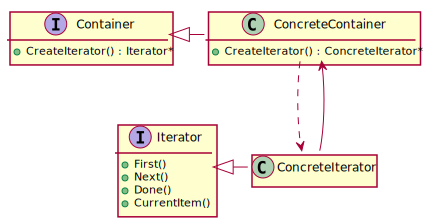

# Iterator (Cursor)

## 意图
Provide a way to access the elements of an aggregate object sequentially without exposing its underlying representation.

提供一种方式，用于遍历容器内的元素，而不暴露容器的底层表示。

## 用途
- 在不暴露容器内部表示的情况下，遍历容器内的元素。
- 用于支持多种遍历方式（例如：先序、中序、后序）。
- 提供一种通用接口 (`for each`)，用于遍历不同容器。

## 类图

## 参与者
- **迭代器** (`Iterator`)
  - 声明用于访问 (`CurrentItem()`) 和遍历 (`First()`, `Next()`, `Done()`) 元素的接口。
- **具体迭代器** (`ConcreteIterator`)
  - 实现 **迭代器** 的接口。
  - 在遍历过程中，追踪当前位置。
- **容器** (`Container`)
  - 声明用于创建 **迭代器** 实例的接口 (`CreateIterator()`)。
- **具体容器** (`ConcreteContainer`)
  - 实现 **容器** 中声明的用于创建 **迭代器** 实例的接口，返回一个 **具体迭代器** 实例。
