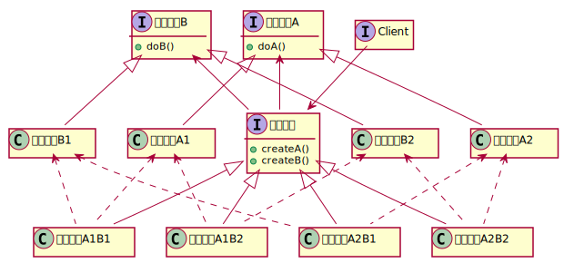

# 抽象工厂模式

## 定义
> Provide an interface for creating families of related or dependent objects without specifying their concrete classes.

## 类图

## 角色
- 接口层
  - 抽象产品 (`AbstractProductX`) --- 定义第 `X` 种产品的接口。
  - 抽象工厂 (`AbstractFactory`) --- 为第 `X` 种抽象产品提供一个创建方法 `createX()`。
  - 用户 (`Client`) --- 仅使用 `AbstractFactory` 和 `AbstractProductX` 的接口。
- 实现层
  - 具体产品 (`ConcreteProductXi`) --- 第 `X` 种抽象产品的第 `i` 种具体实现。
  - 具体工厂 (`ConcreteFactory`) --- 实现 `AbstractFactory` 的接口，可以显式地为所有可能的具体产品组合逐一给出定义，也可以在构造函数（或模板参数）中进行参数化设置。

## Java 示例
[`AbstractFactoryDemo.java`](./AbstractFactoryDemo.java)

## C++ 示例
[`AbstractFactoryDemo.cpp`](./AbstractFactoryDemo.cpp)
