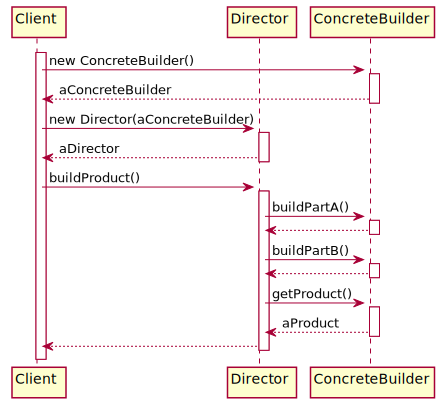

# Builder

## 意图
Separate the construction of a complex object from its representation so that the same construction process can create different representations.

## [类图](./Class.txt)

## [时序图](./Sequence.txt)

