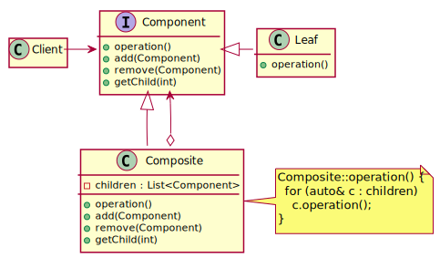

# Composite

## 定义
Compose objects into tree structures to represent part-whole hierarchies.
Composite lets clients treat individual objects and compositions of objects uniformly.

## [类图](./Class.txt)

