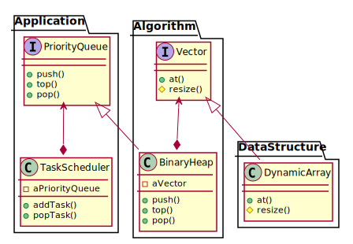

# 设计原则

面向对象设计的五个基本原则（首字母串接起来构成 `SOLID`）：

| 缩写  |              全称                |                中译               |
| :---: | :-----------------------------: | :------------------------------: |
| `SRP` | Single Resposibility Principle  |    [单一责任原则](#单一责任原则)     |
| `OCP` |     Open--Closed Principle      |    [开放封闭原则](#开放封闭原则)     |
| `LSP` |  Liskov Substitution Principle  | [Liskov 替换原则](#Liskov-替换原则) |
| `ISP` | Interface Segregation Principle |    [接口分离原则](#接口分离原则)     |
| `DIP` | Dependency Inversion Principle  |    [依赖倒置原则](#依赖倒置原则)     |

## 单一责任原则

> A class should have only one reason to change.

## 开放封闭原则

> Software entities (classes, modules, functions, etc.) should be open for extension, but closed for modification.

## Liskov 替换原则

> Subtypes must be substitutable for their base types.

## 接口分离原则

> Clients should not be forced to depend on methods that they do not use.

## 依赖倒置原则

> High-level modules should not depend on low-level modules. Both should depend on abstractions.
> Abstractions should not depend on details. Details should depend on abstractions.

### 倒置的含义
*依赖倒置* 首先是指源代码 *依赖关系* （通常表现为 `#include` 或 `import` 语句）与程序 *控制流* 的倒置。

*依赖关系* 的倒置通常也意味着 *接口所有权* 的倒置：
接口代表一种服务，其所有权应当归属于服务的使用者（高层策略模块）而非提供者（底层实现模块）。

下面的示例体现了 *依赖关系* 和 *接口所有权* 的双重倒置：

- 在高层模块 `Application` 中，`TaskScheduler` 的 `addTask(), popTask()` 方法用到了 `PriorityQueue` 接口所提供的 `push(), top(), pop()` 服务；而实现这些服务所用到的算法，并不需要暴露给 `TaskScheduler`。
- 在中层模块 `Algorithm` 中，`BinaryHeap` 借助于 `Vector` 接口的 `at()` 服务，实现了 `PriorityQueue` 接口；而由 `Vector` 隐式提供的 `resize()` 服务，并不需要暴露给 `BinaryHeap`。
- 在底层模块 `DataStructure` 中，`DynamicArray` 借助于更底层的（通常由操作系统提供的）动态内存管理服务，实现了 `Vector` 接口的 `resize()` 服务。

### 语言实现机制
接口可以显式地出现在源代码中，例如：
- 在 Java 中，接口通常表现为 `interface` 或 `abstract class`。
- 在 C++ 中，接口可以表现为含有 *纯虚函数* 的 `class`。
- 在 C++20 中，接口可以表现为 [`concept`](https://en.cppreference.com/w/cpp/language/constraints)。
- 在 Python 3.4+ 中，接口可以表现为借助于标准库模块 [`abc`](https://docs.python.org/3/library/abc.html) 定义的 *抽象类*。

接口也可以仅仅作为一种抽象的 *概念*，例如：
- 在 C++ 中，接口可以表现为对 *模板类型形参* 的隐式约束，凡是满足该约束的 *类型* 都可以被视作是该接口的一个实现。
- 在 Python 等动态语言中，接口可以表现为对 *函数形参类型* 的隐式约束，凡是满足该约束的 *类型* 都可以被视作是该接口的一个实现。

### 面向对象设计 v. 面向对象语言
使用面向对象语言 (C++/Java/Python) 进行编程 *不等于* 面向对象编程。
一段程序是否是面向对象的，取决于程序中的依赖关系是否是倒置的，而与所使用的编程语言无关。
这种依赖关系的倒置是通过 *polymorphism* 来实现的，polymorphism 既可以是静态的（编译期绑定），也可以是动态的（运行期绑定）。
面向对象语言通过一定的语法机制，让 polymorphism 变得更容易、更简洁、更安全。
